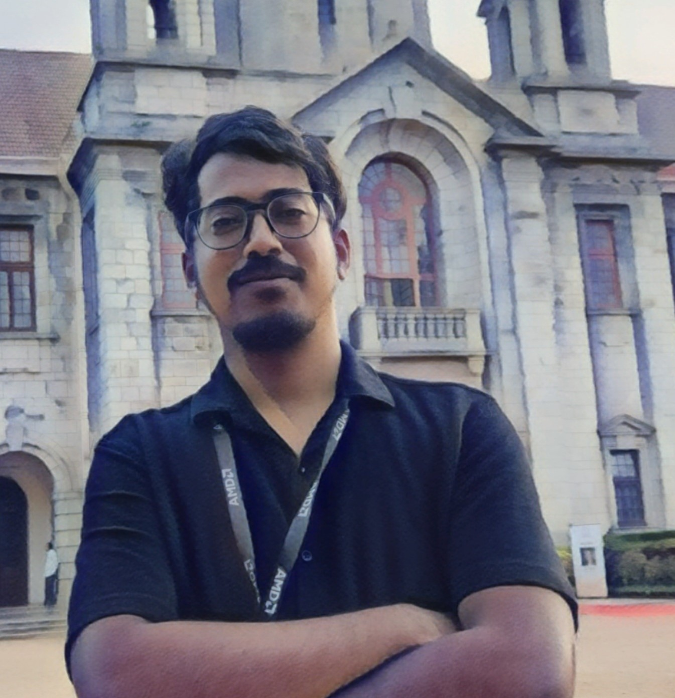

You have landed on the website of Vedang Asgaonkar, a senior undergraduate student at the [Department of Computer Science and Engineering](https://cse.iitb.ac.in) 💻 at IIT Bombay 🇮🇳. I take interest in computer systems and machine learning, particularly the mathematical side of it. I am always up for some elegant puzzles or problems 🧠. Contrary to popular belief, I do have a life. I enjoy hanging out with close friends, and am always up for new experiences. Travel is the love of my life (and food, the way to my heart), and I am a bit more adventurous than my insurance provider would like. You might find me in the gym or playing ping-pong if you drop by at a random time.

## Work

I have done some interesting projects in ML, networks and software development. My most recent internship was in low latency systems at Optiver Amsterdam 🇳🇱. I've done my fair share of research at IITB, in active feature acquisition under Prof. Abir De, and in time series retrieval under Prof. Sunita Sarawagi. I have also been involved in data science research in collaboration with IIMA and Stanford. I've also worked on evolutionary game theory at IST Austria 🇦🇹. 

## Curiosities

I am interested in logical insights on human and social behaviour, and read books and blogs about the same. Models of social interaction, opinion dynamics and competition pique my curiosity. I plan to post some blogs 💬 about the same in my free time (has not happened as of Fall'23). I enjoy writing convoluted sentences that take an entire [NVIDIA A100](https://www.nvidia.com/en-in/data-center/a100/) GPU to understand.

## Teaching

Currently TAing for the undergraduate course in Artifical Intelligence and Machine learning, I have also conducted recitals for the minor course on Design and Analysis of Algorithms. I have also been a TA on the [NPTEL](https://nptel.ac.in/) platform for the course "An Introduction to Programming through C++". I may post resources for courses in the future. Some such resources can be found in my [github](https://github.com/VedangAsgaonkar) repositories. I have also worked as teaching assistant for linear algebra at the dept. of math at IITB.

## Contact me
Come and meet me in person at H17 IIT Bombay. Make sure to bring a protein bar 🍫 or a pizza 🍕 . Alternatively find me on LinkedIn, Instagram or Facebook 🔗. You can also drop a mail to [first name][at]cse[dot]iitb[dot]ac[dot]in

#### Disclaimer
Last Updated: Oct '23. Some parts of this website may contain outdated content. Some of this dates back to the 1st century BC (Before ChatGPT, back when man had only recently figured out that [attention is all he needs](https://arxiv.org/abs/1706.03762)).